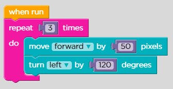
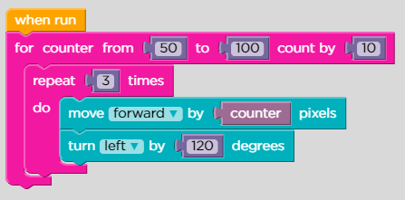
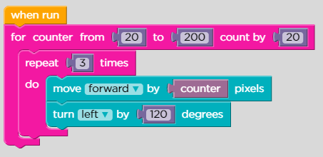
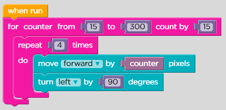
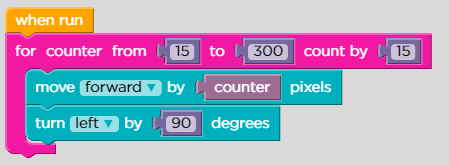
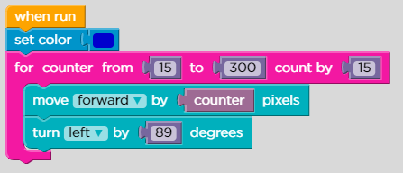
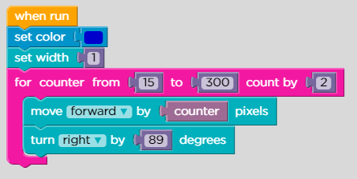
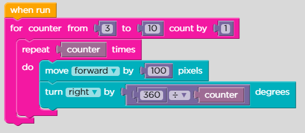
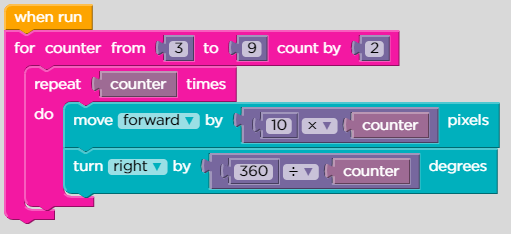
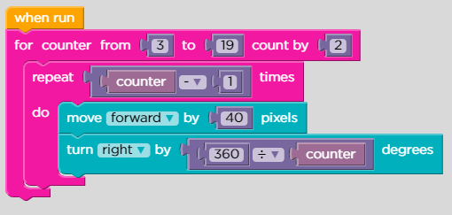

# Lesson 10: Artist: For Loops

## Level: 1

<figure><figcaption></figcaption></figure>

## Level: 2

<figure><figcaption></figcaption></figure>

## Level: 3

<figure><figcaption></figcaption></figure>

## Level: 4

<figure><figcaption></figcaption></figure>

## Level: 5

<figure><figcaption></figcaption></figure>

## Level: 6

<figure><figcaption></figcaption></figure>

## Level: 7

<figure><figcaption></figcaption></figure>

## Level: 8

<figure><figcaption></figcaption></figure>

## Level: 9

<figure><figcaption></figcaption></figure>

## Level: 1**0**

<figure><figcaption></figcaption></figure>

## Level: 1**1**

## Fr33 p1@y go learn ur dumba\$$ brain

## Level: 1**2**

## 🥰🥰
