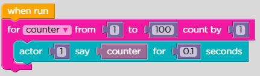
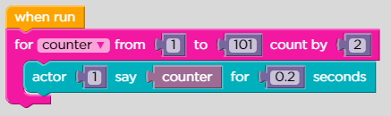
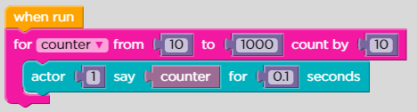
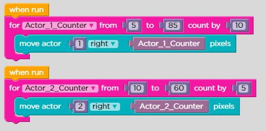
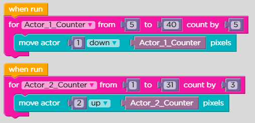
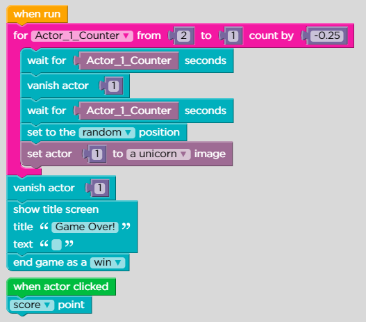

# Lesson 11: Play Lab: For Loops

## Level: 1

<figure><figcaption></figcaption></figure>

## Level: 2

<figure><figcaption></figcaption></figure>

## Level: 3

<figure><figcaption></figcaption></figure>

## Level: 4

<figure><figcaption></figcaption></figure>

## Level: 5

<figure><figcaption></figcaption></figure>

## Level: 6

<figure><figcaption></figcaption></figure>

## Level: 7

## Free Pl@y

#### 😘😘😘😘😘😘😘😘😘
