# Lesson 14: Artist: Functions with Parameters

## Level: 1

<figure><figcaption></figcaption></figure>

## Level: 2

<figure><figcaption></figcaption></figure>

## Function:

<figure>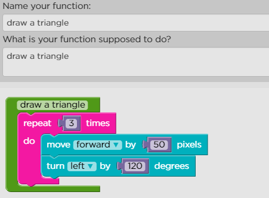<figcaption></figcaption></figure>

## Level: 3

<figure>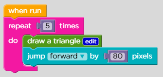<figcaption></figcaption></figure>

## Level: 4

<figure>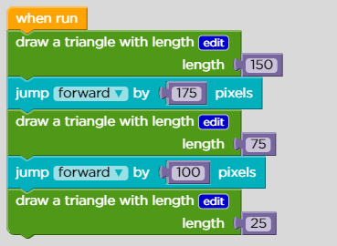<figcaption></figcaption></figure>

## Level: 5

<figure>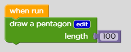<figcaption></figcaption></figure>

## Level: 6

<figure>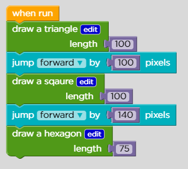<figcaption></figcaption></figure>

## Level: 7

<figure>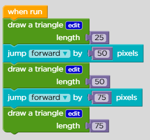<figcaption></figcaption></figure>

## Level: 8

<figure>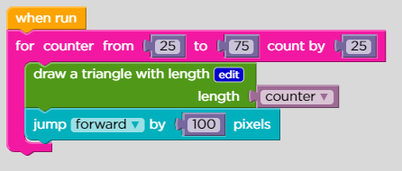<figcaption></figcaption></figure>

## Function:

<figure>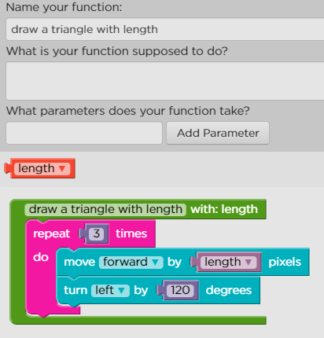<figcaption></figcaption></figure>

## Level: 9

<figure>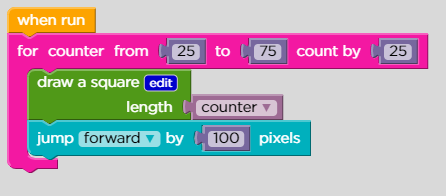<figcaption></figcaption></figure>

## Function:

<figure>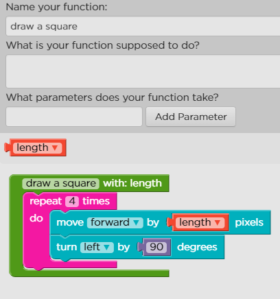<figcaption></figcaption></figure>

## Level: 10

<figure>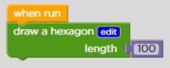<figcaption></figcaption></figure>

## Function:

<figure>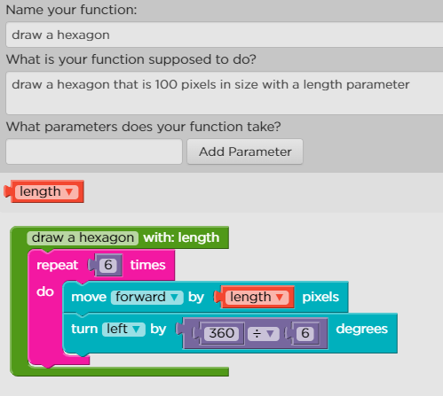<figcaption></figcaption></figure>

## Level: 11

<figure>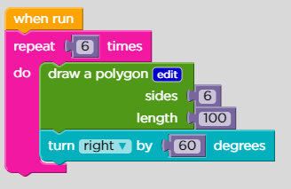<figcaption></figcaption></figure>

## Function:

<figure>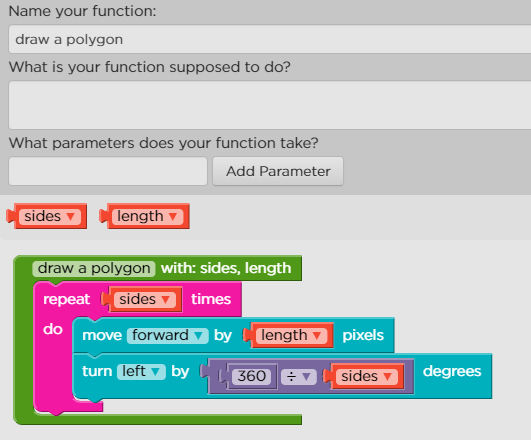<figcaption></figcaption></figure>

## Level: 12

<figure>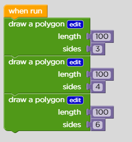<figcaption></figcaption></figure>

## Function:

<figure>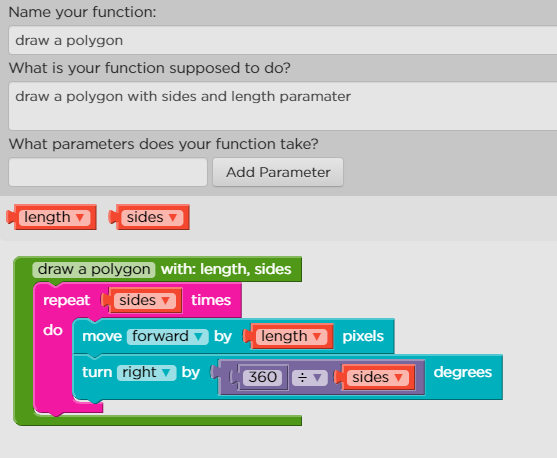<figcaption></figcaption></figure>

## Level: 13

<figure>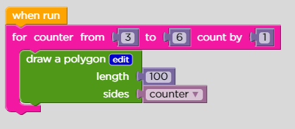<figcaption></figcaption></figure>

## Function:

<figure>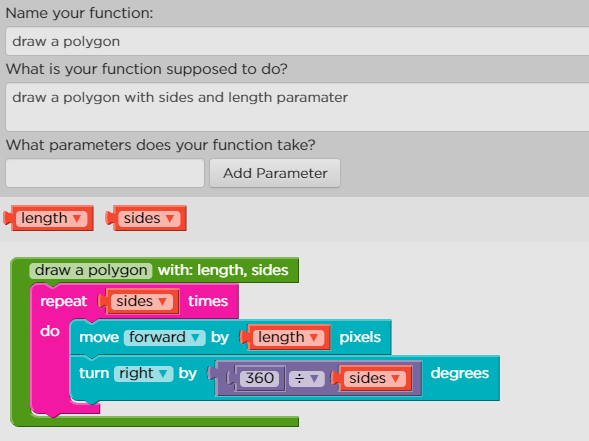<figcaption></figcaption></figure>

## Level: 14

<figure>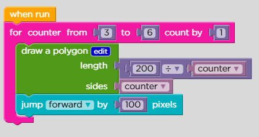<figcaption></figcaption></figure>

## Function:

<figure>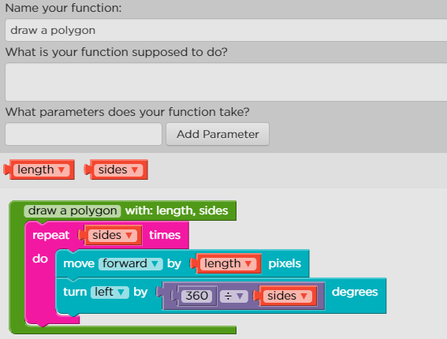<figcaption></figcaption></figure>

## Level: 15

<figure>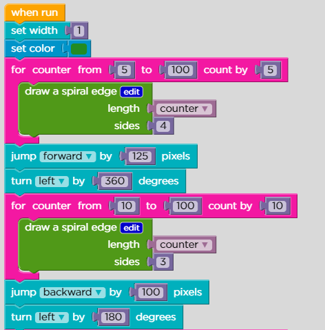<figcaption>
lesson 15 part 1
</figcaption></figure>

<figure>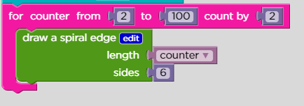<figcaption>
lesson 15 part 2
</figcaption></figure>

## Function:

<figure>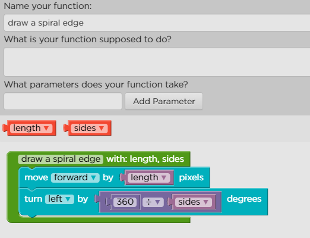<figcaption></figcaption></figure>

## Level: 16

## freE

## Level: 17

## Freee
