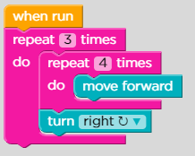
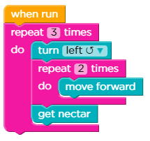
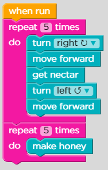
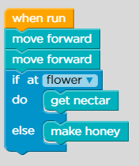

# Lesson 2: Maze and Bee

## Level: 1

<figure><figcaption></figcaption></figure>

## Level: 2

<figure><figcaption></figcaption></figure>

## Level: 3

<figure><figcaption></figcaption></figure>

## Level: 4

<figure><figcaption></figcaption></figure>

## Level: 5

<figure><figcaption></figcaption></figure>

## Level: 6

<figure><figcaption></figcaption></figure>

## Level: 7

<figure><figcaption></figcaption></figure>

## Level: 8

<figure><figcaption></figcaption></figure>

## Level: 9

<figure><figcaption></figcaption></figure>

