# Lesson 21: Super Challenge - Functions and Parameters

## Level: 1

<figure>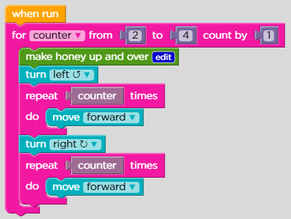<figcaption></figcaption></figure>

## Function:

<figure>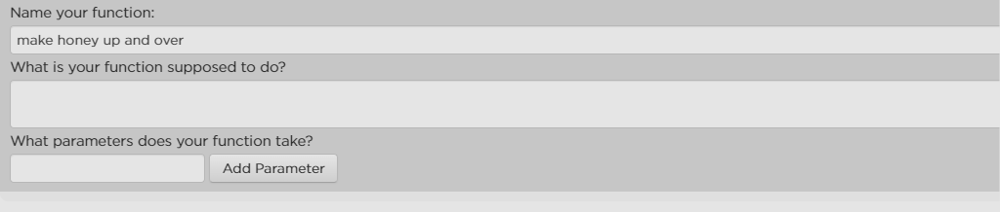<figcaption></figcaption></figure>

<figure>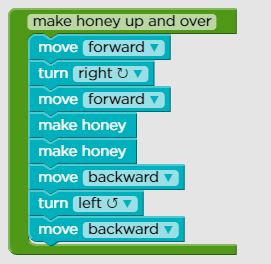<figcaption></figcaption></figure>

## Level: 2

<figure>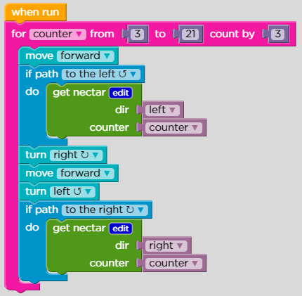<figcaption></figcaption></figure>

## Function:

<figure>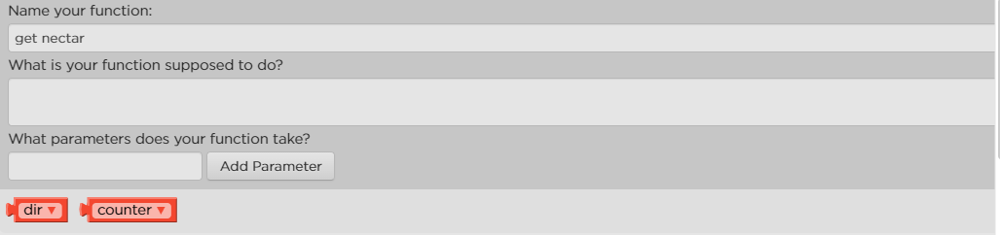<figcaption></figcaption></figure>

<figure>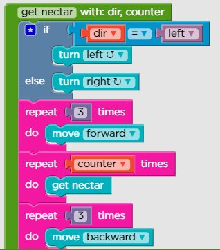<figcaption>
Function getnectar #1
</figcaption></figure>

<figure>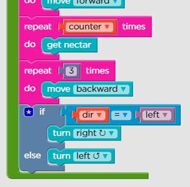<figcaption>
Function getnectar #2
</figcaption></figure>

## Level: 3

<figure>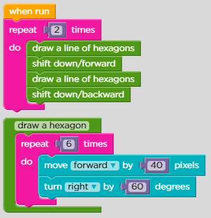<figcaption></figcaption></figure>

<figure>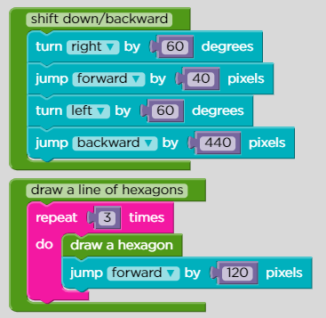<figcaption></figcaption></figure>

<figure>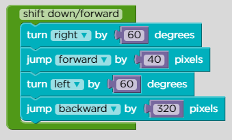<figcaption></figcaption></figure>

## Level: 4

<figure>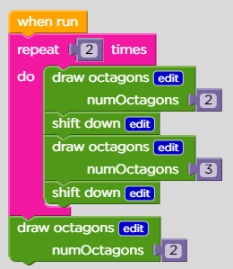<figcaption></figcaption></figure>

## Function:

<figure>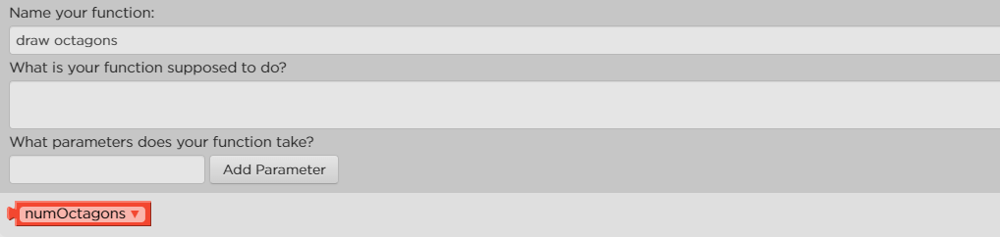<figcaption></figcaption></figure>

<figure>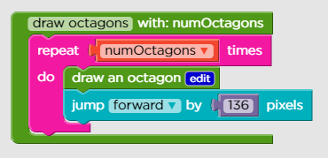<figcaption></figcaption></figure>

<figure>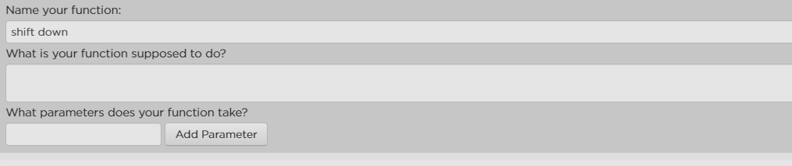<figcaption></figcaption></figure>

<figure>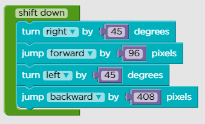<figcaption></figcaption></figure>

## Level: 5

<figure>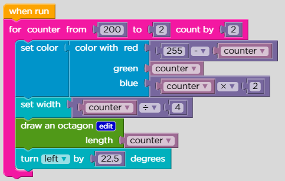<figcaption></figcaption></figure>

## Function:

<figure>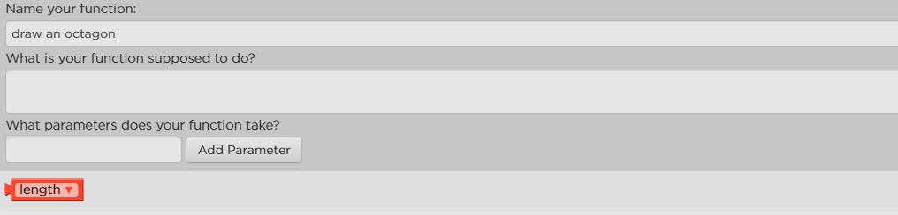<figcaption></figcaption></figure>

<figure>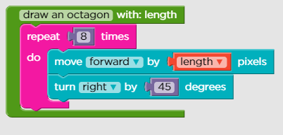<figcaption></figcaption></figure>
