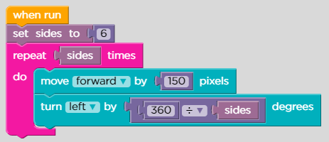

# Lesson 6: Artist: Variables

## Level: 1

<figure><figcaption></figcaption></figure>

## Level: 2

<figure><figcaption></figcaption></figure>

## Level: 3

<figure><figcaption></figcaption></figure>

## Level: 4

<figure><figcaption></figcaption></figure>

## Level: 5

<figure><figcaption></figcaption></figure>

## Level: 6

<figure><figcaption></figcaption></figure>

## Level: 7

<figure><figcaption></figcaption></figure>

## Level: 8

<figure><figcaption></figcaption></figure>

## Level: 9

<figure><figcaption></figcaption></figure>

## Level: 10

<figure><figcaption></figcaption></figure>

## Level: 11

<figure><figcaption></figcaption></figure>

## Level: 12

<figure><figcaption></figcaption></figure>

## Level: 13

<figure><figcaption></figcaption></figure>

## Level: 14

<figure><figcaption></figcaption></figure>

## Level: 15

## Its fuCk1ng fr33 p1@y

## Level: 16

## @@b ch0b 10r j@😘😘😘
