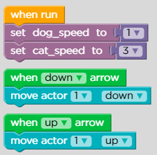
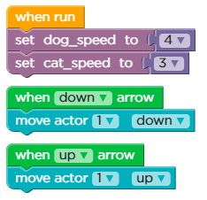
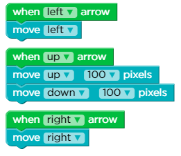
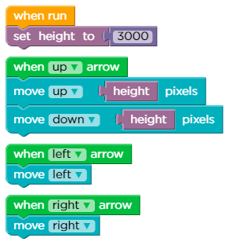
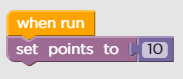
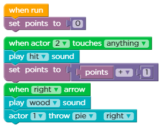
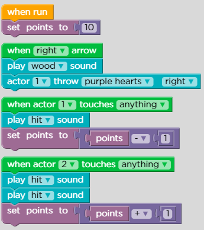

# Lesson 7: Play Lab: Variables

## Level: 1

<figure><figcaption></figcaption></figure>

## Level: 2

<figure><figcaption></figcaption></figure>

## Level: 3

<figure><figcaption></figcaption></figure>

## Level: 4

<figure><figcaption></figcaption></figure>

## Level: 5

<figure><figcaption></figcaption></figure>

## Level: 6

<figure><figcaption></figcaption></figure>

## Level: 7

<figure><figcaption></figcaption></figure>

## Level: 8

## Fr33 p1@y g0 try ur s31f
